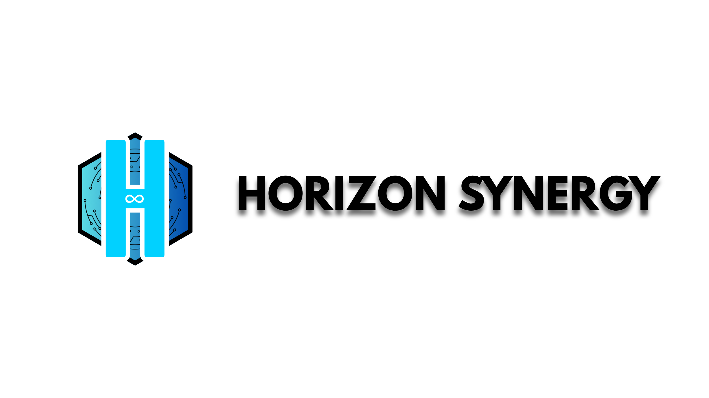
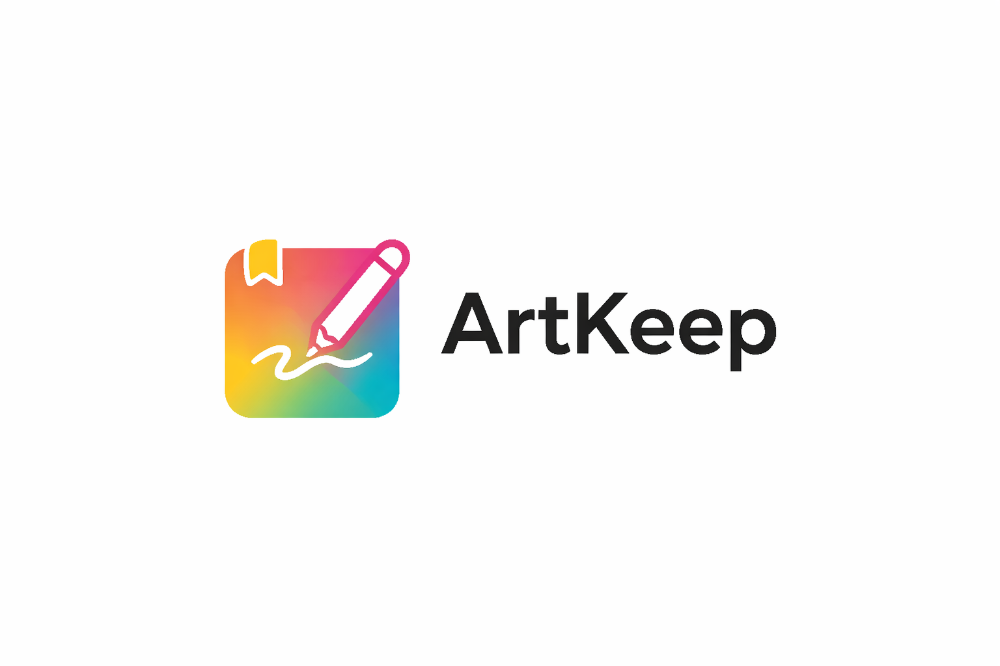

# Cedric Arts

- 👋 Hi, I’m @cedricarts
- 👀 I’m interested in software engineering, app, game, and web development
- 🌱 I’m currently learning Python, C#, React, JavaScript and C++.
- 💞️ I’m looking to collaborate on anything relating to game development and Web design
- 📫 How to reach me: cedricmnisi01@gmail.com 
- Space Dash: https://play.google.com/store/apps/details?id=com.nas.spacedash
- Death Tag (new): https://play.google.com/store/apps/details?id=com.synergy.deathtag
- Horizon Synergy: https://horizon-synergy.github.io
- My portfolio: https://cedricarts.github.io/

### Platforms & Apps I Built
 

  
  
    
  
  
  

### Languages & Frameworks

  
  
  
  
  
  
  
  

###  Tools & Platforms

  
  
  
  
  

###  AI Tools

  
  
  

<!---
cedricarts/cedricarts is a ✨ special ✨ repository because its `README.md` (this file) appears on your GitHub profile.
You can click the Preview link to view your changes.
--->
